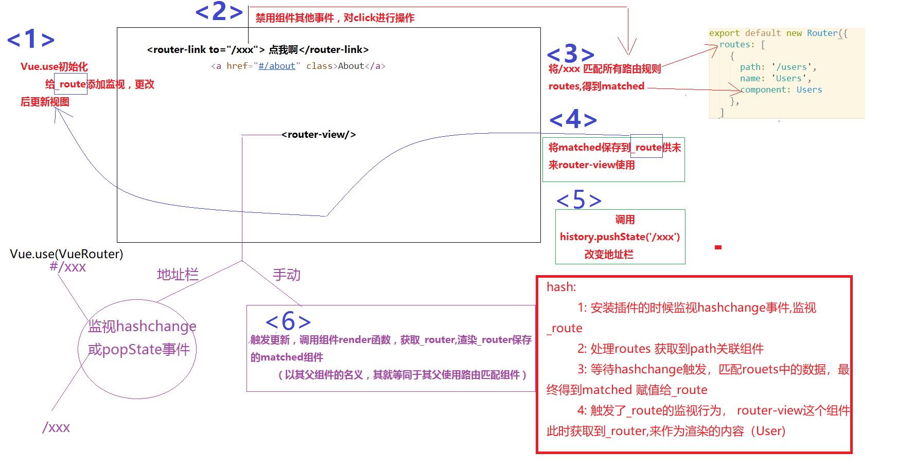
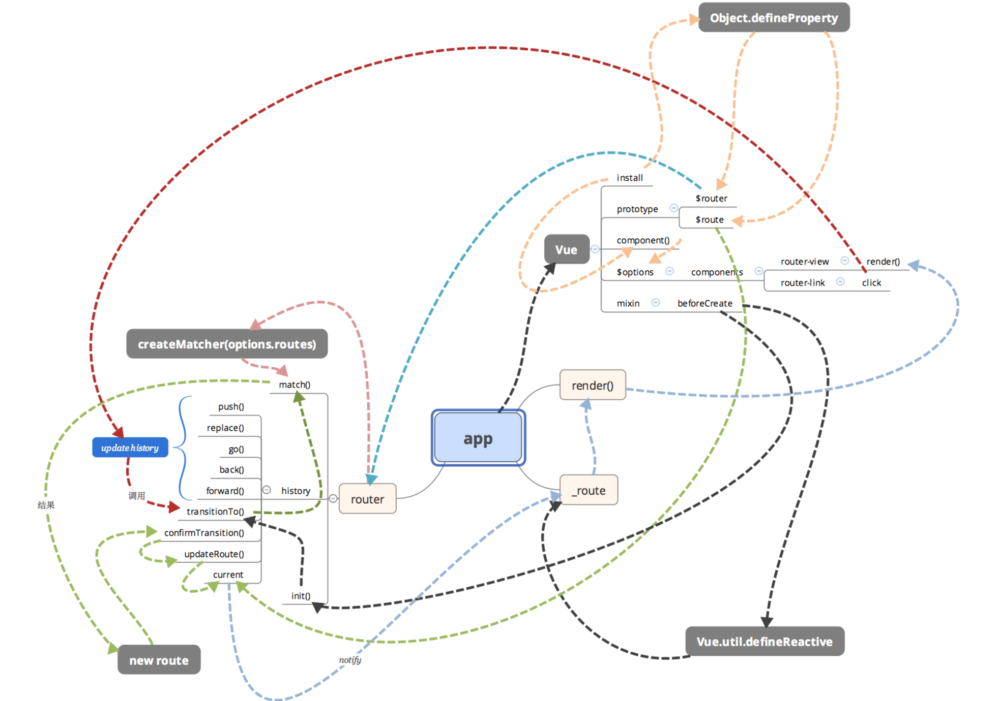
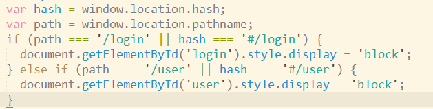

### 路由

####  路由原理

* 传统开发方式 url改变后 立刻发起请求，响应整个页面，渲染整个页面
* SPA 锚点值改变后 不会发起请求,发起ajax请求,局部改变页面数据
  * 页面不跳转 用户体验更好

#### SPA

* single page application(单页应用程序)
* 前端路由
  * 锚点值监视
  * ajax获取动态数据
  * 核心点是锚点值
* 前端框架 Vue/angular/react都很适合开发单页应用

#### 基本使用

* vue-router 
* 其是vue的核心插件
* 1:下载 `npm i vue-router -S`
* 1.2(重要):安装插件`Vue.use(VueRouter);`  
* 2:在main.js中引入vue-router对象 `import VueRouter form './x.js';`
* 3:创建路由对象 `var router = new VueRouter();`
* 4:配置路由规则 `router.addRoutes([路由对象]);`
  * 路由对象`{path:'锚点值',component:要(填坑)显示的组件}`
* 5:将配置好的路由对象交给Vue
  * 在options中传递-> key叫做 router
* 6:留坑(使用组件) `<router-view></router-view>`

#### router-link

* to
* 帮助我们生成a标签的href
* 锚点值代码维护不方便，如果需要改变锚点值名称
  * 则需要改变 [使用次数 + 1（配置规则）] 个地方的代码

#### 命名路由

* 1:给路由对象一个名称 `{ name:'home',path:'/home',component:Home}`
* 2:在router-link的to属性中描述这个规则
  * `<router-link :to="{name:'home'}></router-link>"`
  * 通过名称找路由对象，获取其path，生成自己的href
* 大大降低维护成本，锚点值改变只用在main.js中改变path属性即可


#### 阶段总结

* vue-router使用步骤 : 1:引入 2:安装插件 3:创建路由实例 4:配置路由规则  5:将路由对象关联vue 6:留坑
* router-link   to="/xxx"  命名路由   
  * 1. 在路由规则对象中 加入name属性
    2. 在router-link中  :to="{ name:"xxx'} "


* 生僻API梳理:

  * 1. Vue.use(插件对象);   //  过程中会注册一些全局组件,及给vm或者组件对象挂在属性

    2. 给vm及组件对象挂在的方式  :  Object.defineProperty(Vue.prototype,'$router',{

       ​	get:function () {
       ​		return 自己的router对象;

       ​	}

       })

#### 参数router-link,

* `Vue.prototype.xxx = {add:fn}`
* 所有组件中，使用this.xxx就能拿到这个对象
* 查询字符串 
  * 1:配置`:to="{name:'detail',query:{id:hero.id} }"`
  * 2:规则 `{name:'detail',path:'/detail',component:Detail}`
  * 3:获取 `this.$route.query.id`
  * 4:生成 `<a href="/detail?id=1">`
* path方式 
  * 4:生成 `<a href="/detail/1">`
  * 1:配置 `:to="{name:'detail',params:{id:hero.id}  }"`
  * 2:规则 `{ name:'detail',path:'/detail/:id'}`
  * 3:获取 `this.$route.params.id`
* 查询字符串配置参数
  * router-link一次
  * 获取的时候一次
* path方式配置参数
  * router-link一次
  * 规则配置的时候声明位置
  * 获取的时候一次
* 总结书写代码注意事项
  * path方式需要在路由规则中声明位置

#### vue-router中的对象

* $route 路由信息对象,只读对象
* $router 路由操作对象,只写对象

#### 嵌套路由


* 市面上所谓的用单页应用框架开发多页应用
  * 嵌套路由
* 案例
  * 进入我的主页显示：电影、歌曲
* 代码思想
  * 1:router-view的细分
    * router-view第一层中，包含一个router-view
  * 2:每一个坑挖好了，要对应单独的组件
* 使用须知: 1:router-view包含router-view 2:路由children路由

#### 知识点介绍

* 路由meta元数据 -> meta是对于路由规则是否需要验证权限的配置
  * 路由对象中 和name属性同级 ```{  meta:{ isChecked:true  }  }```
* 路由钩子 -> 权限控制的函数执行时期
  * 每次路由匹配后,  渲染组件到router-view之前
  * ```router.beforeEach(function(to,from,next) {    } )```

#### 编程导航

* 1: 跳到指定的锚点,并显示页面 ```this.$router.push({ name:'xxx',query:{id:1},params:{name:'abc'}  });```
* 2: 配置规则 ```{name:'xxx',path:'/xxx/:name'}```
* 3: 根据历史记录.前进或后退
  * ```this.$router.go(-1|1);```
  * 1代表进一步,-1是退一步

### axios

#### 基本使用

```js
Axios.method('url',[,..data],options)
.then(function(res){  })
.catch(function(err) { } )
```

#### 合并请求

* ```js
  this.$axios.all([请求1,请求2])
  .then(  this.$axios.spread(function(res1,res2){  
           
           })
  )
  ```

#### 拦截器

- 单请求配置options: `axios.post(url,data,options);`
- 全局配置defaults: `this.$axios.defaults`
- config : `请求拦截器中的参数`
- response.config `响应拦截器中的参数`

* options
  - baseURL 基础URL路径
  - params 查询字符串（对象）
  - transformRequest 转换请求体数据
  - transformResponse 转换响应体数据
  - headers 头信息
  - data 请求体数据
  - timeout 请求超时，请求多久以后没有响应算是超时（毫秒）


### 模块化

* webpack命令
  npm init -y
  npm install webpack@3.6.0 --save-dev --registry https://registry.npm.taobao.org
* package.json文件
  `"scripts": {
    "test": "webpack ./main.js ./build.js"
  },`
* 命令行运行 npm run test

#### ES6模块

* 导入和导出只能存在顶级作用域
* require引入是代码执行的时候才加载
* import 和export 都是提前加载 ，加载在代码执行之前

#### 箭头函数和function

* 一方面箭头函数是种简写形式
* 应用场景: 由于箭头函数本身没有this和arguments，通常用在事件类的回调函数上，让其向上级function绑定this，而非事件对象
* 箭头函数不可以作为构造函数

#### ES6函数简写

* 用在对象的属性中

  ```js
  fn3() { //干掉了:function,用在对象的属性中
  
  				console.log(this);
  
  		},
  
  ```


#### vue-router的导航守卫之在导航完成后获取数据

需求：在导航完成之后加载数据。渲染DOM

```javascript
<!DOCTYPE html>
<html lang="en">
<head>
	<meta charset="UTF-8">
	<title></title>
</head>
<body>
	<div id="app"></div>
	<script type="text/javascript" src="vue.js"></script>
	<script type="text/javascript" src="vue-router.js"></script>
	<script type="text/javascript" src="axios.js"></script>
	<script type="text/javascript">

		// 导航完成后获取数据，这让我们有机会在数据获取期间展示一个 loading 状态，还可以在不同视图间展示不同的 loading 状态。
		var Index = {
			template:`
				<div>我是首页</div>
			`
		};

		var Post = {
			data(){
				return {
					loading:false,
					error:null,
					post:null
				}
			},
			template:`
				<div>
					<div class = 'loading' v-if = 'loading'>
						loading.....
					</div>
					<div v-if="error" class = 'error'>
						{{error}}
					</div>
					<div class = 'content' v-if = 'post'>
						<h2>{{post.title}}</h2>
						<p>{{post.body}}</p>
					</div>
				</div>
			`,
			created(){
				// 组件创建完成后获取数据
				// 此时data已经被监听了
				this.fetchData();

			},
			watch:{
				'$route':'fetchData'
			},
			methods:{
				fetchData(){
					this.error = null;
					this.post = null;
					this.loading = true;
					this.$axios.get('http://127.0.0.1:8888/post')
					.then(res=>{
						this.loading = false;
						console.log(res.data);
						this.post = res.data;
					})
					.catch(err=>{
						this.err = err.toString();
					})

				}
			}
		}

		var router = new VueRouter({
			routes:[
				{
					path:'/index',
					name:'index',
					component:Index
				},
				{
					path:'/post',
					name:'post',
					component:Post
				}
			]
		});

		var App = {
			template:`
				<div>
					<router-link :to = "{name:'index'}">首页</router-link>
					<router-link :to = "{name:'post'}">我的博客</router-link>

						<router-view></router-view>


				</div>
			`
		};
		Vue.prototype.$axios  = axios;
		new Vue({
			el:"#app",
			data:{

			},

			components:{
				App
			},
			template:`<App />`,
			router
		});
	</script>
</body>
</html>


```

#### vue-router的导航守卫之导航完成之前获取数据

需求：在导航完成之前获取数据，之后再渲染DOM

```javascript
<!DOCTYPE html>
<html lang="en">

<head>
    <meta charset="UTF-8">
    <title></title>
</head>

<body>
    <div id="app"></div>
    <script type="text/javascript" src="vue.js"></script>
    <script type="text/javascript" src="vue-router.js"></script>
    <script type="text/javascript" src="axios.js"></script>
    <script type="text/javascript">
    // 导航完成后获取数据，这让我们有机会在数据获取期间展示一个 loading 状态，还可以在不同视图间展示不同的 loading 状态。

    var vm = null;
    var User = {
        data() {
            return {
                error: null,
                user: ''
            }
        },
        template: `
				<div>
					<div v-if="error" class = 'error'>
						{{error}}
					</div>
					<div class = 'user' v-if = 'user'>
						<h2>{{user}}</h2>
					</div>
				</div>
			`,
        beforeRouteEnter(to, from, next) {
            // 在渲染该组件的对应路由被 confirm 前调用
            // 不！能！获取组件实例 `this`
            // 因为当守卫执行前，组件实例还没被创建


            console.log(to);
            axios.get(`http://127.0.0.1:8888/user/${to.params.id}`)
                .then(res => {

                    next(vm => vm.setData(res.data))

                })
                .catch(err => {
                    console.log(err);
                    next(vm => vm.setError(err));
                })
        },
        beforeRouteUpdate(to, from, next) {
        	 // 在当前路由改变，但是该组件被复用时调用
	    // 举例来说，对于一个带有动态参数的路径 /foo/:id，在 /foo/1 和 /foo/2 之间跳转的时候，
	    // 由于会渲染同样的 Foo 组件，因此组件实例会被复用。而这个钩子就会在这个情况下被调用。
	    // 可以访问组件实例 `this`

            this.user = null;
            this.$axios.get(`http://127.0.0.1:8888/user/${to.params.id}`)
                .then(res => {
                    this.setData(res.data);
                    next();
                })
                .catch(err => {
                 	   this.setError(err);
                    next();
                })


        },
        methods: {
            setData(user) {
                this.$nextTick(() => {
                    this.user = user;
                })
            },
            setError(err) {
                this.err = err.toString();

            }

        }

    }

    var router = new VueRouter({
        routes: [{
            path: '/user/:id',
            name: 'user',
            component: User,

        }]
    });

    var App = {
        template: `
				<div>
					
					<router-link :to = "{name:'user',params:{id:1}}">我的用户1</router-link>
					<router-link :to = "{name:'user',params:{id:2}}">我的用户2</router-link>

						<router-view></router-view>


				</div>
			`
    };
    Vue.prototype.$axios = axios;
    vm = new Vue({
        el: "#app",
        data: {

        },

        components: {
            App
        },
        template: `<App />`,
        router
    });
    </script>
</body>

</html>
```

#### history模式

* 如果不希望看到丑陋的 # 可以使用history模式 ， 其原理依赖于 history.pushState函数
  * a标签点击以后，如果没有# 必然会页面跳转发起请求
  * 使用pushState函数可以改变url     比如  /abc 而不会发起请求
  * js通过location.pathname获取该值 /abc  做页面局部的替换
* router-view的history简单实现原理
  * 
* router-view实现图解
  * 


#### 自制webpack插件实现骨架屏

* 
* 原理分析：
  * 1: 从路由A跳到路由B慢不慢？  你敢说慢？ 因为A的时候各种js已经加载好了ok
  * 2: 那到底是什么比较慢 ？ A的首次加载
    * 慢会带来什么？
      * 1: 首屏白屏(量太大，渲染好久)
      * 2: 首屏卡顿(加载一半，一半卡住)
    * 解决方案：
      * 1: 客户端太慢，渲染容易卡住。。 服务端渲染好页面，客户端就加载个html完事
      * 2: 白屏也不错，但是如果能有个骨架屏，看起就爽了
* 插件实现思路
  * 
  * 需要在vue的执行代码加载之前，先让用户看到骨架屏，带app代码执行 new Vue() 替换<div id="app"></div> 就好了
  * 决定加载什么js的是index.html,操作他的插件是html-webpack-plugin
  * 我们让自己的插件再其后操作，并根据其留下的数据入口获取数据并更改
* 效果预览
  * html
    * 
  * 后续逻辑
    * 
  * 再来卡顿
    * 


* 插件代码

  * ```js
    let MyPlugin = function (options) {
      this.template = options.template;
    }
    
    MyPlugin.prototype.apply = function (compiler) {
      // console.log(compiler);
      console.log('我们的插件被执行了');
      // 先指定自己怎么编译，根据别人的编译结果操作
      compiler.plugin('compilation', compilation => {
          
          compilation.assets['./tjx.txt'] = {
              size:function () {
                  return 'abc'.length;
              },
              source:function () {
                return 'abc'
              }
            }
          
          
          	// 别人编译的入口
              compilation.plugin('html-webpack-plugin-before-html-processing',(htmlData,callback) => {
                  // html-webpack-plugin中间插入行为的地方
                  htmlData.html = htmlData.html.replace(`<div id="app"></div>`,`
                    <div id="app">
                      <div style="background-color:red;height:300px;display:none;" id="default" >
                          我是默认的骨架屏
                      </div>
                      <div style="background-color:red;height:300px;display:none;" id="user" >
                          我是user的骨架屏
                      </div>
                      <div style="background-color:red;height:300px;display:none;" id="login" >
                          我是login的骨架屏
                      </div>
                    </div>
                    <script>
                          var hash = window.location.hash;
                          var path = window.location.pathname;
                          if (path === '/login' || hash === '#/login') {
                            document.getElementById('login').style.display = 'block';
                          } else if (path === '/user' || hash === '#/user') {
                            document.getElementById('user').style.display = 'block';
                          }
                    </script>
                    `);
                  // 不论如何两个参数，错误在前
                  callback(null,htmlData);
    
              });
    
      });
    }
    module.exports = MyPlugin;
    ```

  * 使用插件（接着html插件）

    * 


#### 多页应用

* 核心思想: 其实就是两个vue项目，一次webpack打包，关联用url联系
  * webpack操作:
    * 1. 多个入口 {  main1:'./usermain.js',main2:'./goodsmain.js'  }
      2. 多个html插件
* 注意事项
  * 
* getHtmls的思路
  * 更为灵活的读取各项目下的js文件（入口）  entry:{‘js文件名’:'js文件路径' } 
  * 更为灵活的读取各项目下的html文件（首页.html） ``` plugins:[].concat(   [   new HtmlWebpackPlugin(),new HtmlWebpackPlugin()    ]    )```
    * filename属性是生成的相对dist的文件名  xxx.html
    * template 模板生成的参照物  需要绝对路径||相对路径 './xxx.html'
    * chunks:[filename]   指定第三引入的js文件名称
    * 
      * 这个[name]其实就是entry的key


